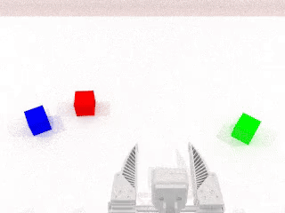

# Panthera-HT_RoboTwin

本仓库基于 [RoboTwin 2.0](https://github.com/RoboTwin-Platform/RoboTwin)，面向 Panthera 六自由度机械臂，提供仿真、专家数据采集、轨迹回放和多 Policy 数据转换能力。Panthera 适配和维护由 [Yinghao Ho](https://github.com/CherrySama) from [HighTorque Robotics](https://github.com/HighTorque-Robotics) 完成。

当前仓库支持：

- 双臂 Panthera：左右两台机械臂，原生 14 维动作；
- 单臂 Panthera：场景只初始化一台居中的机械臂，原生 7 维动作（6 个关节 + 1 个夹爪）；
- RoboTwin 原生 CuRobo、TOPP、SAPIEN 执行和场景随机化接口；
- 头部相机、腕部相机、HDF5、轨迹、视频和物理准入报告输出；
- 通过 [`RoboTwin/policy/README.md`](RoboTwin/policy/README.md) 转换 ACT、Pi0、Pi0.5、GO1、RDT、TinyVLA、DexVLA、DP 和 DP3 数据。
- 任务采集配置具体看 [`RoboTwin/task_config/README.md`](RoboTwin/task_config/README.md) 

  <p align="center">
    
  </p>

## 仓库目录

```text
RoboTwin/
├── assets/
│   └── embodiments/panthera-6dof/    # Panthera URDF、SRDF、网格和 CuRobo 配置
├── description/                      # 任务和物体语言模板、instruction 生成器
├── envs/                             # RoboTwin 任务、机器人和相机仿真逻辑
├── task_config/                      # 任务、相机、embodiment 和采集配置
│   ├── README.md                     # 任务适配配置详情
├── script/
│   ├── collect_data.py               # 采集主入口
│   ├── replay_data.py                # SAPIEN Viewer 密集轨迹回放
│   ├── eval_policy.py                # RoboTwin 原生评测入口
│   └── _download_assets.sh           # RoboTwin 通用资产下载脚本
├── policy/
│   ├── README.md                     # Policy 转换、训练和评测说明
│   ├── data_convert.py               # 公共 Policy 数据转换入口
│   ├── train.py                      # ACT/Pi0.5 统一训练入口
│   ├── eval.py                       # ACT 统一评测入口
│   └── <policy>/                     # 各 Policy 原生代码
└── README.md
```

## 1. 环境配置

建议使用 Linux、NVIDIA GPU、Conda 和可用的 Vulkan。采集和数据转换必须使用不同环境：

| 环境 | 用途 | 主要版本 |
| --- | --- | --- |
| `RoboTwin` | Panthera 仿真、CuRobo/TOPP 规划、SAPIEN 采集、视频和 HDF5 | Python 3.10.20，PyTorch 2.7.1 + CUDA 12.8，SAPIEN 3.0.0b1，MPlib 0.2.1，CuRobo 0.7.8 |
| `RoboTwinData` | 原始 HDF5 到各 Policy 训练格式的转换 | Python 3.11.15，PyTorch 2.6.0 + CUDA 12.4，Zarr 2.18.4，固定 LeRobot commit |

Policy 模型训练和推理环境不属于这两个基础环境，必须按对应 Policy 的原生要求单独配置。

克隆外层仓库后，以下环境、资产和 Quick Start 命令均从内层 RoboTwin 代码目录执行：

```bash
cd RoboTwin
```

### 1.1 主机条件

采集依赖可用的 NVIDIA 驱动和 Vulkan loader。先检查现有主机，不要默认安装整组系统包：

```bash
nvidia-smi
ldconfig -p | grep libvulkan
command -v git
command -v unzip
command -v ffmpeg || true
command -v nvcc || true
nvcc --version || true
```

只有明确缺少时才安装对应工具：`git` 用于获取代码，`unzip` 用于解压通用资产，`libvulkan1` 提供 Vulkan loader。`vulkan-tools` 只用于额外诊断，不参与采集运行；NVIDIA 主机不应为了本项目默认安装 `mesa-vulkan-drivers`。`nvidia-smi` 显示的 CUDA 版本是驱动兼容上限，不等于 `nvcc` 编译器版本。

### 1.2 `RoboTwin` 采集环境

```bash
conda create -n RoboTwin python=3.10.20 -y
conda activate RoboTwin
python --version
```

视频保存要求 PATH 中存在 FFmpeg 命令。仅在 `command -v ffmpeg` 无输出时安装：

```bash
conda install -y -c conda-forge ffmpeg=7
```

安装 PyTorch：

```bash
python -m pip install torch==2.7.1 torchvision==0.22.1 \
  --index-url https://download.pytorch.org/whl/cu128
python -c "import torch; print(torch.__version__, torch.version.cuda, torch.cuda.is_available())"
```

CuRobo 会编译 CUDA 扩展，`nvcc` 必须与 PyTorch 的 CUDA 12.8 匹配。先执行 `nvcc --version`；未找到 `nvcc` 或版本不是 12.8 时才安装 Conda 编译器：

```bash
conda install -y -c nvidia/label/cuda-12.8.0 cuda-compiler=12.8
hash -r
nvcc --version
python -c "from torch.utils.cpp_extension import CUDA_HOME; print(CUDA_HOME)"
```

安装 Panthera RGB 采集实际使用的最小依赖：

```bash
python -m pip install \
  numpy==1.26.4 scipy==1.10.1 sapien==3.0.0b1 mplib==0.2.1 \
  transforms3d==0.4.2 trimesh==4.4.3 open3d==0.18.0 \
  gymnasium==0.29.1 toppra==0.6.9 h5py==3.16.0 \
  opencv-python==4.11.0.86 imageio==2.34.2 \
  Pillow==11.3.0 PyYAML==6.0.3 huggingface-hub==0.25.0 \
  warp-lang==1.12.0 setuptools==69.5.1 setuptools-scm==10.2.1 \
  wheel==0.47.0 ninja==1.13.0
```

`open3d` 当前由相机模块在启动时直接导入，即使 RGB 配置不保存点云也不能省略。PyTorch3D 仅用于点云最远点采样，默认 RGB 采集可以不安装；此时启动日志中的 `missing pytorch3d` 是预期提示。需要点云或 DP3 数据时再安装：

```bash
python -m pip install \
  "git+https://github.com/facebookresearch/pytorch3d.git@V0.7.8" \
  --no-build-isolation
```

安装官方 CuRobo v0.7.8。Panthera 配置当前依赖该源码位于固定的 `envs/curobo` 层级，因此必须使用 editable install，不能从临时目录非 editable 安装：

```bash
test -d envs/curobo/.git || \
git clone --branch v0.7.8 --depth 1 \
  https://github.com/NVlabs/curobo.git envs/curobo

test "$(git -C envs/curobo rev-parse HEAD)" = \
  "d64c4b005459db10c5dd867d8b30a87d5bda9bdb"
python -m pip install -e envs/curobo --no-build-isolation
```

新环境还需要应用 RoboTwin 官方安装流程中的 SAPIEN UTF-8 和 MPlib screw planner 兼容修改：

```bash
SAPIEN_LOCATION=$(python -m pip show sapien | awk '/^Location:/{print $2}')/sapien
sed -i -E \
  's/("r")(\))( as)/\1, encoding="utf-8") as/g' \
  "$SAPIEN_LOCATION/wrapper/urdf_loader.py"

MPLIB_LOCATION=$(python -m pip show mplib | awk '/^Location:/{print $2}')/mplib
sed -i -E \
  's/(if np.linalg.norm\(delta_twist\) < 1e-4 )(or collide )(or not within_joint_limit:)/\1\3/g' \
  "$MPLIB_LOCATION/planner.py"
```

不要把上游 `bash script/_install.sh` 直接当作本仓库的完整安装方案；它会安装与当前验证版本不同的依赖，并尝试重新 clone `envs/curobo`。

检查核心依赖：

```bash
python -c "import torch, sapien, mplib, curobo, open3d, cv2, h5py, toppra; print(torch.__version__, torch.version.cuda, torch.cuda.is_available(), curobo.__version__)"
python -m pip show nvidia-curobo | grep -E "Version|Editable project location"
ffmpeg -version
python -m pip check
```

上述最小采集环境已于 2026-08-26 在全新 Conda 环境中完成 Panthera 单臂 RGB clean-room smoke：CuRobo 规划、SAPIEN 仿真以及 165 帧 HDF5、头部/腕部视频、轨迹、场景信息和 instruction 均通过完整性检查。该结果不自动覆盖双臂、点云或全部随机化 seed。

### 1.3 `RoboTwinData` 转换环境

```bash
conda create -n RoboTwinData python=3.11.15 -y
conda activate RoboTwinData
python -m pip install torch==2.6.0 torchvision==0.21.0 \
  --index-url https://download.pytorch.org/whl/cu124
python -m pip install \
  numpy==1.26.4 h5py==3.16.0 opencv-python==4.11.0.86 \
  PyYAML==6.0.3 Pillow==11.0.0 datasets==3.2.0 \
  pyarrow==18.1.0 tqdm==4.67.1 zarr==2.18.4 numcodecs==0.13.1 \
  huggingface-hub==0.28.1 diffusers==0.31.0 rerun-sdk==0.21.0 \
  transformers==4.41.0 sentencepiece==0.2.0 accelerate==0.30.1
python -m pip install \
  "lerobot @ git+https://github.com/huggingface/lerobot.git@a445d9c9da6bea99a8972daa4fe1fdd053d711d2"
```

Zarr 必须保持 2.x；LeRobot 必须固定到已验证的 commit。检查：

```bash
python -c "import torch, h5py, cv2, zarr, lerobot, transformers; print(torch.__version__, zarr.__version__)"
python policy/data_convert.py --policy act --help
python -m pip check
```

## 2. 准备仿真资产

Panthera 资产随本仓库发布；RoboTwin 通用任务物体、背景纹理和其他通用 embodiment 通过下载脚本获取：

```bash
command -v unzip
bash script/_download_assets.sh
```

下载脚本会自行解压并删除 `background_texture.zip`、`embodiments.zip` 和 `objects.zip`，随后更新 embodiment 路径，不要再手动重复解压。只有 `command -v unzip` 无输出时才需要补装该系统工具。如果 Hugging Face 限流，先执行 `huggingface-cli login`。Panthera 目录至少应包含：

```text
assets/embodiments/panthera-6dof/
├── panthera_6dof.urdf
├── panthera_6dof.srdf
├── config.yml
├── curobo.yml
├── collision_panthera.yml
└── meshes/
```

检查资产：

```bash
test -f assets/embodiments/panthera-6dof/panthera_6dof.urdf
test -f assets/embodiments/panthera-6dof/panthera_6dof.srdf
test -f assets/embodiments/panthera-6dof/config.yml
test -f assets/embodiments/panthera-6dof/curobo.yml
test -f assets/embodiments/panthera-6dof/collision_panthera.yml
test -d assets/embodiments/panthera-6dof/meshes
test -d assets/objects
test -d assets/background_texture
```

## 3. Quick Start

以下命令仍从内层 `RoboTwin/` 代码目录执行。首次验证建议通过命令行覆盖采集条数和输出根目录，不需要修改任务 YAML。

### 3.1 采集双臂数据

先激活 `RoboTwin` 环境并采集 1 条 smoke 数据：

```bash
conda activate RoboTwin
python -u script/collect_data.py \
  move_pillbottle_pad \
  move_pillbottle_pad_panthera
```

### 3.2 采集单臂数据

单臂配置只初始化一台居中 Panthera，输出原生 7 维数据：

```bash
python -u script/collect_data.py \
  move_pillbottle_pad \
  move_pillbottle_pad_panthera_single
```

`blocks_ranking_rgb` 当前也提供双臂配置：

```bash
python -u script/collect_data.py \
  blocks_ranking_rgb \
  blocks_ranking_rgb_panthera
```

采集结果位于：

```text
data/<task>/<task_config>/
├── data/episodeN.hdf5
├── _traj_data/episodeN.pkl
├── instructions/episodeN.json
├── physics_validation/episodeN_physics.json  # 仅显式启用物理监控时存在
├── video/
├── scene_info.json
└── seed.txt
```

单臂 HDF5 的动作形状是 `arm=[T,6]`、`gripper=[T]`、`vector=[T,7]`；双臂为 14 维。采集完成后，instruction JSON 由 `scene_info.json` 派生生成，不参与专家轨迹规划。

### 3.3 回放一条采集轨迹

```bash
python script/replay_data.py \
  data/quick_start_smoke/move_pillbottle_pad/move_pillbottle_pad_panthera_single/data/episode0.hdf5
```

双臂示例：

```bash
python script/replay_data.py \
  data/quick_start_smoke/move_pillbottle_pad/move_pillbottle_pad_panthera/data/episode0.hdf5
```

回放要求保留同一 episode 的 HDF5、`_traj_data/episodeN.pkl` 和 `seed.txt`。

### 3.4 转换 Policy 数据

Policy 转换全部在 `RoboTwinData` 中执行，具体命令见 [`RoboTwin/policy/README.md`](RoboTwin/policy/README.md)：

```bash
conda activate RoboTwinData
python policy/data_convert.py --policy <act|pi0|pi05|go1|rdt|tinyvla|dexvla|dp|dp3> --help
```

当前公共 adapters 主要按双臂 14 维状态/动作和头部、左右腕部三路相机实现。单臂 7 维数据已经完成采集验证，但尚不能直接推断所有 Policy converter 都已支持该 schema。

## 4. Common Issues

### 环境和渲染

- 采集必须在 `RoboTwin` 中执行；Policy 数据转换必须在 `RoboTwinData` 中执行；模型训练和推理使用对应 Policy 的独立环境。
- SAPIEN 或 Vulkan 报错时，检查 NVIDIA 驱动、Vulkan ICD 和 Panthera 完整资产，而不是只检查 URDF。
- `ffmpeg` 不存在时视频写入会失败；采集环境应安装真正的 `ffmpeg` 命令行程序。
- CuRobo 编译出现 `detected CUDA version ... mismatches ... PyTorch` 时，比较 `nvcc --version` 与 `torch.version.cuda`；`nvidia-smi` 的 CUDA 数字不能代替编译器版本。
- CuRobo 必须从内层代码目录的 `envs/curobo` 以 editable 模式安装。若错误路径指向 Conda 的 `site-packages/curobo/.../assets/embodiments`，说明安装位置不符合 Panthera 当前路径约定；随后出现的 `Robot object has no attribute left_planner` 通常只是规划器首次初始化失败后的连锁错误。
- 默认 RGB 采集未安装 PyTorch3D 时显示 `missing pytorch3d` 属于预期提示；只有点云最远点采样和 DP3 流程需要它。
- RTX 5060 Ti 可能出现 OIDN CUDA 兼容警告。只要 HDF5 RGB 非空、视频完整解码且帧数对齐，该警告本身不等于数据损坏。

### 采集和回放

- 当前配置文件使用 `.yml`，例如 `blocks_ranking_rgb_panthera.yml`，不是 `.yaml`。
- 单臂和双臂不能混用轨迹、seed 或 HDF5；回放会校验 schema、动作维度和轨迹模式。
- 采集失败时先看终端中的物体稳定性、规划和任务成功条件日志。只有配置显式启用 `physics_validation` 时才会生成对应报告并增加物理准入；默认采集不会生成该目录。
- 如果 Panthera 夹爪能短暂抬起杯子/碗但随后滑落，先检查腕部视频中的夹持深度。当前临时对照显示，将默认抓取深度从 `grasp_dis=0` 增加到 `grasp_dis=-0.02`（沿抓取方向深入约 2 cm）后，`hanging_mug` 和 `stack_bowls_three` 的夹持稳定性明显改善。该补偿尚未作为全局默认参数合入，不能直接修改 `tool_link` 或关节限位；正式采用前应在目标任务上检查是否穿透、推偏并完成回归。
- `DP3` 要求原始 HDF5 含非空 `/pointcloud`；默认 RGB 采集配置通常不会满足这一条件。

### Instruction 和 Policy

- RoboTwin 原生 instruction 生成器会在模板不足时循环补齐 `language_num`，因此 nominal 数量不等于唯一语言数量。
- instruction 是采集结束后根据 `scene_info.json` 派生的。修复生成器后可以只重生成 JSON，不必重采集视频和物理轨迹。
- 具体 Policy 的转换、训练、权重和前置条件统一查看 [`RoboTwin/policy/README.md`](RoboTwin/policy/README.md)。

### 发布前检查

- 当前只对已列出的 Panthera 任务做过真实验证，不能据此推断所有 RoboTwin 任务都支持单臂，例如一些双臂协调的任务便没有加入单臂采集的配置。
- 本仓库不包含 Panthera 真机 SDK、真机控制或 sim-to-real 安全保证。

## License

除另有说明外，仓库外层新增文件由 HighTorque Robotics 按 [MIT License](LICENSE) 发布。`RoboTwin/` 目录保留 RoboTwin 原有许可证、版权声明及第三方组件许可证；其上游 README、论文和 BibTeX 引用见 [`RoboTwin/docs/ROBOTWIN_UPSTREAM_README.md`](RoboTwin/docs/ROBOTWIN_UPSTREAM_README.md)。
